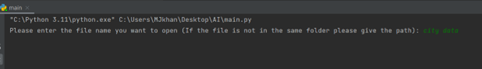
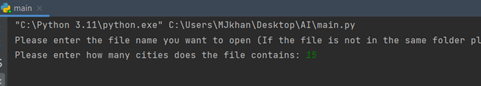
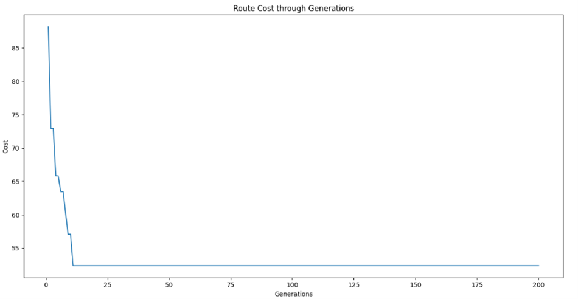
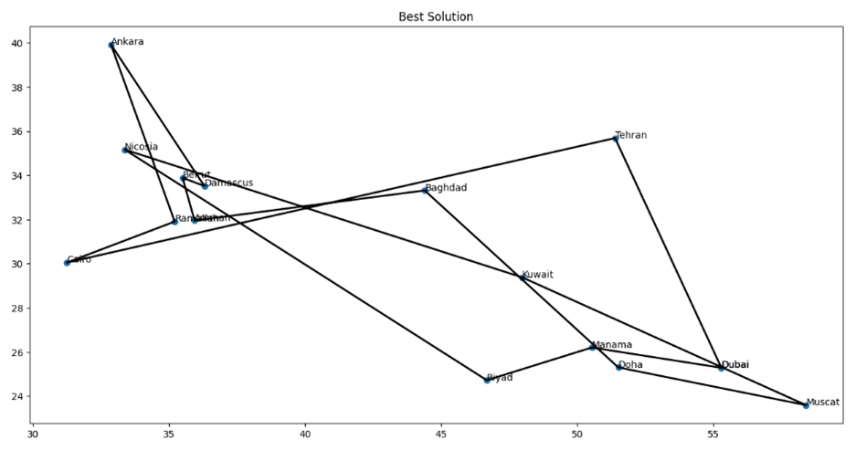

# Traveling Salesman Problem (TSP) Solver using Genetic Algorithm

This project provides a solution to the Traveling Salesman Problem (TSP) using a genetic algorithm. The solution is implemented in Python and utilizes the principles of genetic algorithms to find an optimal route for visiting a given set of cities.

## Features

- **Genetic Algorithm Implementation**: Uses genetic algorithms to evolve solutions over generations.
- **Visualization**: Plots the cost over generations and the final route on a 2D plane.
- **Customizable Parameters**: Allows customization of the number of generations, population size, and mutation rate.

## Installation

To run this project, you need to have Python installed along with the following libraries:

```sh
pip install numpy matplotlib
```

## Usage

1. **Prepare the Dataset**: Create a file containing the city data with each line formatted as `id x y name`.
2. **Run the Script**: Execute the main script to start the genetic algorithm and find the optimal route.

### Example Command

```sh
python main.py
```

## How It Works

### Initialization

The algorithm starts by initializing a population of random routes. Each route is a possible solution to the TSP and is represented by a sequence of cities.

### Selection

The selection process involves picking the best routes based on their fitness values. The fitness value is inversely proportional to the total distance of the route.

### Crossover

Crossover is performed to create new routes (children) by combining segments from two parent routes. Different crossover strategies are implemented to ensure diversity in the population.

### Mutation

Mutation introduces small changes to a route to maintain genetic diversity and prevent premature convergence to a suboptimal solution.

### Evolution

Over multiple generations, the algorithm evolves the population by selecting the best routes, performing crossover, and applying mutation. The best route found in each generation is recorded.

### Visualization

The cost of the best route in each generation is plotted to show the improvement over time. Additionally, the final route is displayed on a 2D plane with city names.

### Images

#### Data File Processing



##### Asking the user to specify the number of locations in the file



#### Route Cost through Generations



#### Best Solution



## Code Structure

### main.py

The main script initializes parameters, runs the genetic algorithm, and handles the visualization of results.

### Chromosome.py

This module defines the `City` and `Chromosome` classes. It also handles the creation of the dataset and the distance matrix.

### Genetic_Algorithm.py

This module implements the genetic algorithm, including functions for initialization, selection, crossover, mutation, and evolution.
